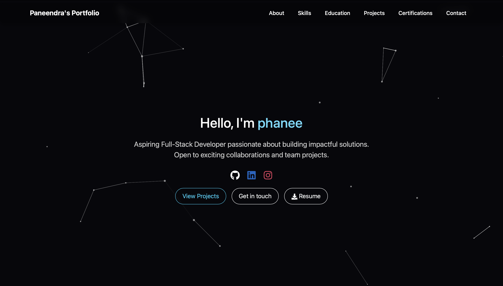

# 🧑‍💻 Developer Portfolio

Welcome to my personal developer portfolio website! This project showcases my skills, projects, certifications, and education using a modern, responsive, and dark-themed UI.

## 🌐 Live Demo

👉 [portfolio-phanee27s-projects.vercel.app](https://portfolio-phanee27s-projects.vercel.app)

## 📸 Preview



## 🚀 Features

- 💡 Intro section with animated name and subheading
- ✨ Particle background using `tsparticles`
- 🧰 Skills displayed with icons and grouped by domain
- 🎓 Education shown in a vertical timeline layout
- 🛠️ Projects section with embedded demo, tech tags, and live/code links
- 📜 Certifications section with logos and credential links
- 📄 Resume download button
- 📬 Contact form using FormSubmit (no backend needed)
- 🌙 Dark theme with modern styling
- 📱 Fully responsive on all devices

## 🛠️ Tech Stack

- **React.js** (with Vite)
- **React Bootstrap** – layout & components
- **React Awesome Reveal** – animations
- **React Icons** – icons for skills and social links
- **tsparticles** – animated background
- **FormSubmit** – form handling via email
- **HTML5**, **CSS3**

## 📂 Folder Structure

```bash
├── public/
│   ├── Resume.pdf
│   └── logos/               # Certificate logos
├── src/
│   ├── components/          # Reusable components (ShinyText, DecryptText, ParticlesBackground)
│   ├── App.jsx              # Main application
│   ├── App.css              # Styles
├── screenshot.png           # Preview image
├── package.json
└── README.md
